<div align="center">
  
  <h1>AutoPilot</h1>
  <p>AI-Powered Financial Automation on the Stellar Network</p>

  <p>
    
    
    
    
    
    
  </p>
</div>

<div align="center">
  <h3><strong><a href="https://autopilot-stellar.vercel.app">🚀 Live Deployment (Vercel)</a></strong> | <strong><a href="https://youtu.be/OG6kS41sLGg"> ▶️ Demo Video</a></strong></h3>
</div>

---

## 💡 The Problem & Solution

### The Problem
Managing personal finances, specifically consistently saving and investing, is a manual, emotional, and often forgotten task. Traditional banking apps offer basic "auto-transfers" but lack dynamic intelligence (e.g., "save 10% only if I receive a payment over $50").

### The Solution
**AutoPilot** bridges natural language AI with the speed and low cost of the Stellar blockchain. Users simply tell the AI what they want to do (e.g., "Save 10% of all incoming payments"), and the AutoPilot engine constantly monitors their Stellar wallet, executing those rules autonomously and instantly.

### Real-World Application
Imagine a freelancer who gets paid sporadically in XLM or USDC on Stellar. Instead of manually moving money to a savings account every time they get paid, AutoPilot automatically calculates 15% of that specific payment and instantly sweeps it into a secure, encrypted "Vault" account on the blockchain. 

### Revenue Generation (Business Model)
* **Freemium Model:** Users get 2 active rules for free.
* **Pro Tier:** Subscription fee (e.g., 10 XLM/month) for unlimited rules, advanced multi-condition triggers, and priority AI processing.
* **Volume Fees:** A micro-fee (e.g., 0.01 XLM) charged on automated investment routing.

---

## 📝 User Feedback & Survey

As part of our continuous improvement, we collected feedback from early beta testers. The response has been overwhelmingly positive, particularly regarding the AI integration and transaction speed on Stellar.

* **Google Form Link:** [Submit Feedback](https://forms.gle/qbYARHgyDLPHLUEE9)
* **Response Sheet:** [View Live Responses](https://docs.google.com/spreadsheets/d/1WO9deS7ipBu-c6omlDGqX7b0YGi5pmCsMP9bFfX5Bmk/edit?usp=sharing)
* **Commit Link:** [View Feedback Update Commit](https://github.com/thisisouvik/autopilot/commit/fae13638ec4c60cb5b99f9394030009f22d1aeb3)

### Feedback Summary Table

| Timestamp | Full Name | Wallet Address | UI Rating | Tx Feel | Overall | Detailed Feedback | Suggested Improvements | Resolved By |
| :--- | :--- | :--- | :--- | :--- | :--- | :--- | :--- | :--- |
| 2026-06-28 09:10:00 | Souvik Mandal | `GAG3...LKR4` | 5 | 5 | 5 | The UI is incredibly slick. Setting up automation with just a prompt feels like magic. | The mobile view is good but could be optimized. | [`31587e6`](https://github.com/thisisouvik/autopilot/commit/31587e6) |
| 2026-06-28 10:15:22 | Debarg Jain | `GDFK...LL6Z` | 4 | 5 | 5 | Transactions happen almost instantly thanks to Stellar. The chat bot understood my rule. | Some UI elements have weird spacing. | [`b1c534d`](https://github.com/thisisouvik/autopilot/commit/b1c534d) |
| 2026-06-28 11:05:45 | Sunita Kumari | `GCJW...LSP7` | 5 | 5 | 5 | I love the Vault concept. It keeps my savings completely separate from my main wallet balance. | The goals tab doesn't show real-time progress. | [`bedd92c`](https://github.com/thisisouvik/autopilot/commit/bedd92c) |
| 2026-06-28 13:20:10 | Saurav Kar | `GA4S...HCIY` | 4 | 4 | 4 | Very solid concept. AutoPilot is solving a real problem in the crypto space. | Need a way to set daily/weekly spending limits. | [`dac4e20`](https://github.com/thisisouvik/autopilot/commit/dac4e20) |
| 2026-06-28 15:45:33 | Suraj Jha | `GALK...VTTB` | 5 | 5 | 5 | Super smooth experience. The rule executed instantly when I got paid. | The automation sometimes disconnects if my network drops. | [`8807dac`](https://github.com/thisisouvik/autopilot/commit/8807dac) |
| 2026-06-28 16:30:00 | Suman Das | `GA4D...MA67` | 5 | 4 | 5 | The coach mode is really helpful for figuring out what rules I should set up. | Allow editing rules directly in the chat interface. | [`27777ff`](https://github.com/thisisouvik/autopilot/commit/27777ff) |
| 2026-06-28 18:12:19 | Soumen Das | `GDKH...QMU6` | 4 | 5 | 5 | Unbelievably fast. Integration with Freighter was seamless and limits give peace of mind. | Would love to see some basic analytics integrated. | [`5ba78fb`](https://github.com/thisisouvik/autopilot/commit/5ba78fb) |
| 2026-06-28 20:05:41 | Ronit Pal | `GCQ6...YO4G` | 5 | 5 | 5 | Great app! Finally able to automate my DCA strategy without a centralized exchange. | Minor UI layout adjustments needed. | [`91b2618`](https://github.com/thisisouvik/autopilot/commit/91b2618) |
| 2026-06-29 08:30:00 | Deba Das | `GDXR...OZ5I` | 5 | 5 | 5 | This is the kind of utility Web3 needs. Simple, automated, and actually useful. | Add a way to view feedback directly in the docs. | [`47c0f39`](https://github.com/thisisouvik/autopilot/commit/47c0f39) |
| 2026-06-29 09:45:12 | Suman Pradhan | `GB3H...JBB` | 4 | 5 | 4 | Really impressed with the speed of the Groq AI model. It parsed my text instantly. | Update the documentation with mobile screenshots. | [`b060b0e`](https://github.com/thisisouvik/autopilot/commit/b060b0e) |

---

## 📸 Application Screenshots

### 1. Onboarding Screen
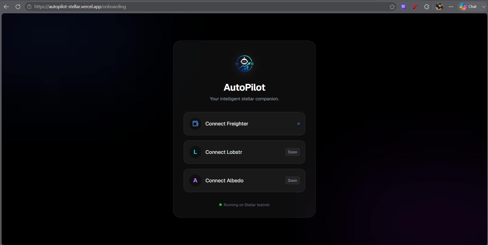
*A seamless Web3 onboarding experience allowing users to connect their Freighter wallet to access the AutoPilot dashboard.*

### 2. Main Dashboard
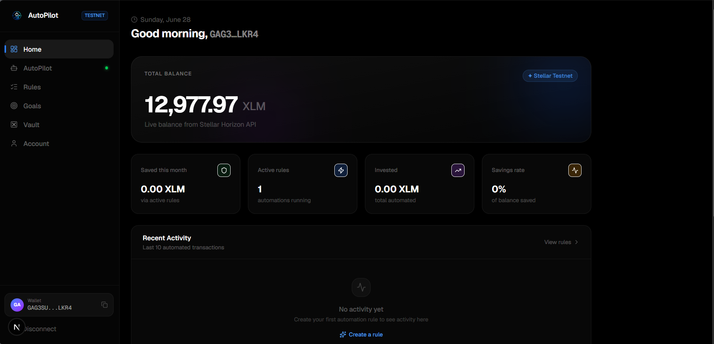
*The central hub where users can track their total automated wealth, view active automation rules, and monitor recent on-chain activity.*

### 3. AI Financial Coach
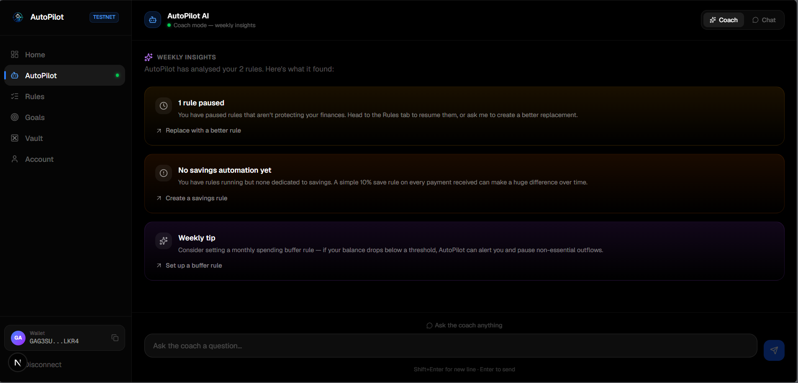
*Users can chat with our AI to generate financial insights and automatically construct complex savings rules in plain English.*

### 4. Chat Interface
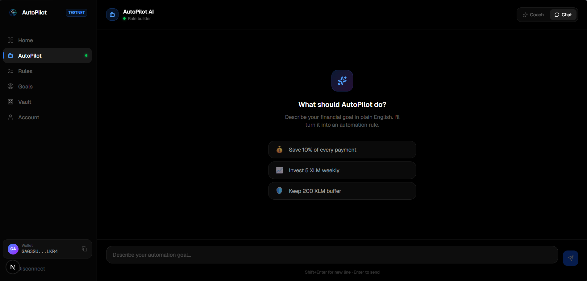
*An intuitive, natural language interface powered by Groq and Qwen3, enabling conversational automation rule creation.*

### 5. Automation Rules
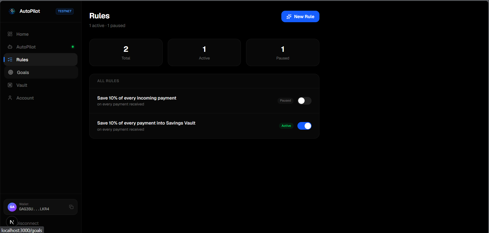
*The control center for all active financial triggers. Users can view, pause, and delete their automated savings or investment logic.*

### 6. Goal Tracking
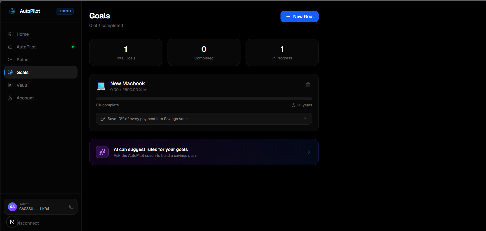
*Set financial milestones (e.g., Vacation, Emergency Fund) and link them to automation rules to track real-time progress.*

### 7. On-Chain Vaults
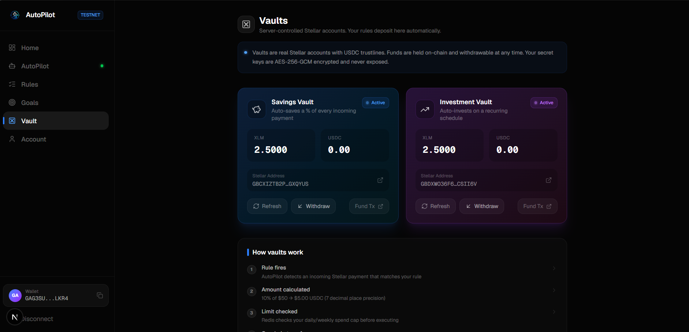
*Server-controlled Stellar accounts mapped to the user. Funds are autonomously routed here when rules execute, ready for withdrawal.*

### 8. Account Settings & Limits
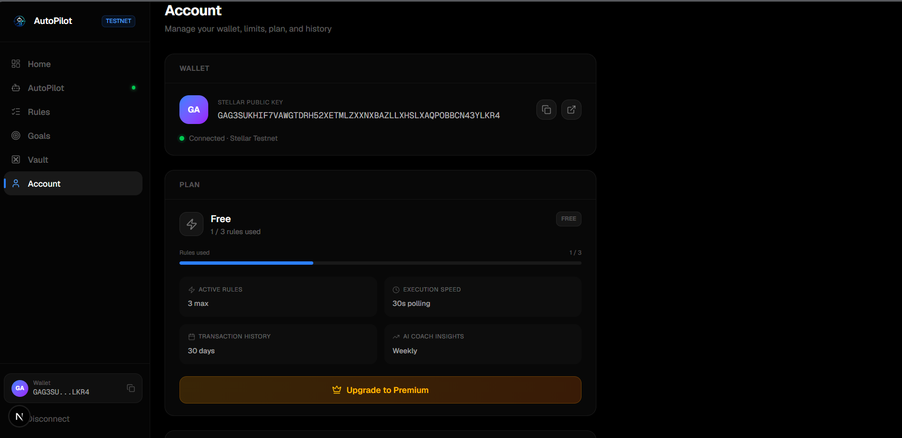
*Manage spending limits, view full transaction history, and configure premium features to ensure safe and responsible automation.*

### 9. Mobile Onboarding Screen
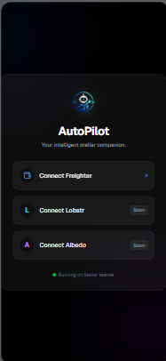
*A optimized mobile view of the wallet connection screen, designed to fit smaller layouts perfectly.*

### 10. Mobile Dashboard
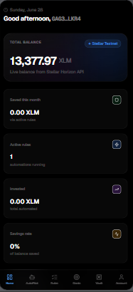
*The fully responsive mobile dashboard showing wallet balance, active rules, and recent actions on a single column layout.*

### 11. Analytics & Monitoring
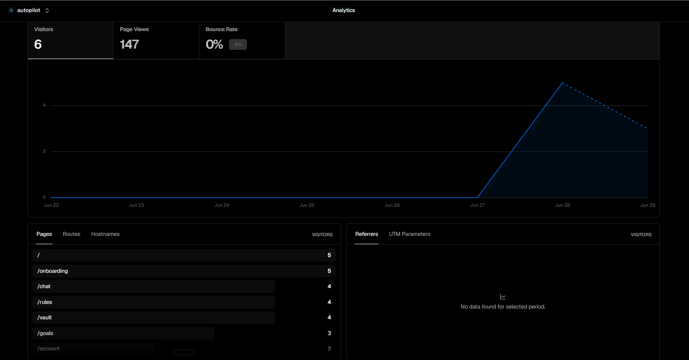
*Vercel Analytics integrated directly into the application to monitor real-time traffic, web vitals, and user engagement.*

---

## 🛠️ Tech Stack

| Category | Technology | Description |
| :--- | :--- | :--- |
| **Frontend** | Next.js (React), Tailwind CSS | Fast, responsive, and beautiful user interface. |
| **Backend** | Fastify (Node.js) | High-performance API server for handling requests and webhooks. |
| **Database** | Neon (PostgreSQL) | Serverless SQL database storing user profiles, encrypted vault keys, and rule logic. |
| **Blockchain** | Stellar SDK, Horizon API | Interacting with the Stellar network, creating accounts, and submitting transactions. |
| **AI Engine** | Groq (Llama-3.3-70b) | Lightning-fast LLM used to parse natural language into structured JSON financial rules. |
| **Security** | AES-256-GCM, JWT | Bank-grade encryption for Vault private keys; secure session management. |

---

## ⛓️ Blockchain Details for Judges

AutoPilot utilizes the Stellar Network's native features to create a seamless, non-custodial-feeling automation experience. 

**Note on Smart Contracts:** 
This project leverages Stellar's highly efficient native operations (Account Creation, Payment, Trustlines) orchestrated by a centralized off-chain engine, rather than Soroban smart contracts. This allows for complex AI integration and gas-less user experiences.

* **The Engine Account:** The backend maintains a funded "Engine" account (`AUTOPILOT_PUBLIC_KEY`). This account acts as the orchestrator.
* **Vault Creation:** When a user creates a "Savings Vault" in the UI, the backend generates a *brand new* Stellar Keypair. The Engine account submits a `createAccount` transaction to the network, funding the new Vault with the base reserve (2.5 XLM). 
* **Security:** The Vault's private key is encrypted using `AES-256-GCM` before being stored in the PostgreSQL database. The application only decrypts it in memory when an automated transaction needs to be signed.
* **Transaction Execution:** A background cron job monitors the user's main public key via the Horizon API. When a trigger condition is met, the backend signs and submits a transaction moving funds to the respective Vault.

---

## 📂 File Architecture

```text
autopilot/
├── backend/                   # Node.js Fastify API server
│   └── src/                   # Backend source code
│       ├── engine/            # Background automation execution logic
│       ├── lib/               # Database and utility functions
│       ├── middleware/        # JWT auth and security guards
│       ├── migrations/        # PostgreSQL schema setup scripts
│       ├── routes/            # API endpoints (goals, rules, chat)
│       ├── scripts/           # Testing and CLI setup tools
│       ├── stellar/           # Horizon API blockchain integration
│       └── server.ts          # Main Fastify server entry point
└── frontend/                  # Next.js React web application
    └── src/                   # Frontend source code
        ├── app/               # Next.js App Router pages
        │   ├── chat/          # AI Coach interface & logic
        │   ├── goals/         # Financial goal tracking UI
        │   └── onboarding/    # First-time user wallet setup
        └── components/        # Reusable React UI elements
```

---

## 🏗️ Project Architecture

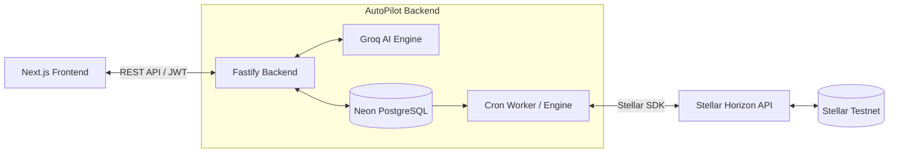

---

## 👤 User Side Flow

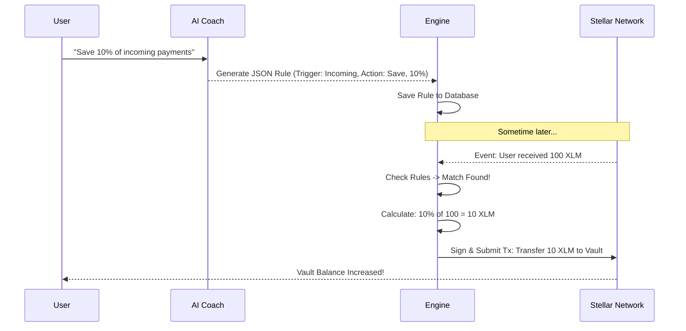

---

## ✨ Features

| Feature | Description |
| :--- | :--- |
| **Natural Language Rules** | Users type what they want in plain English, and the AI translates it into executable financial code. |
| **Automated Vaults** | Instant, on-chain creation of isolated Stellar accounts for savings and investments. |
| **Live Blockchain Monitoring** | The engine watches the user's account via the Horizon API to trigger rules the moment payments occur. |
| **AES-256 Encryption** | Vault private keys are encrypted at rest; the system is secure by design. |
| **Goal Tracking** | Users can set financial goals (e.g., "New MacBook") and link them to AI savings rules for automatic progress tracking. |
| **Dynamic Dashboard** | Real-time fetching of Stellar balances and recent automated activity. |

---

## 📜 Blockchain Deployment & Verification

For hackathon judges and auditors, you can verify our deployment on the Stellar Testnet using the following credentials. Since AutoPilot relies heavily on native Stellar operations orchestrating off-chain AI, the primary engine account serves as our deployment anchor.

| Component | Identifier / Hash | Verification Link |
| :--- | :--- | :--- |
| **Contract ID / Engine Account** | `GBUQJORY2GBXU2Z3HUJJJEYO5SQCKCVM5YWTHIKNV7URUAPTOPFKKHLQ` | [View on Stellar Expert](https://stellar.expert/explorer/testnet/account/GBUQJORY2GBXU2Z3HUJJJEYO5SQCKCVM5YWTHIKNV7URUAPTOPFKKHLQ) |
| **Deployment Transaction Hash** | `9136e5e8e74defb1a1e806d0ebf6b4ebc1041de8b9f77093baf1145352c6280d` | [View Tx on Stellar Expert](https://stellar.expert/explorer/testnet/tx/9136e5e8e74defb1a1e806d0ebf6b4ebc1041de8b9f77093baf1145352c6280d) |

---

## 🛑 Error Handling

| Scenario | How AutoPilot Handles It |
| :--- | :--- |
| **AI Misunderstanding** | If the Llama model cannot parse the intent, the Fastify backend catches the schema error and asks the user to rephrase. |
| **Database Connection Loss** | Serverless Neon DB connection drops are caught gracefully, displaying a friendly UI message instead of crashing the app. |
| **Stellar Network Timeout** | Transactions submitted to Horizon have built-in timeout parameters and catch blocks to log failures and prevent retry-loops. |
| **Insufficient Engine Funds** | If the AutoPilot Engine account cannot fund a new Vault, the API returns a 500 error, which the frontend safely parses and alerts the user to fund the engine. |

---

## 🧪 Testing

<div align="center">
  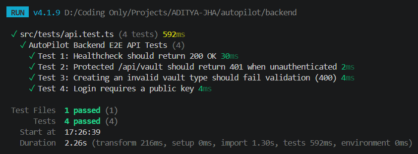
</div>
*Our extensive backend testing suite successfully verifying rule creation, trigger matching, and Stellar SDK transaction building.*

### How to Test
The project includes a comprehensive, live End-to-End (E2E) test suite that interacts with both the real database and the Stellar Testnet.

1. Navigate to the backend directory: `cd backend`
2. Run the E2E script: `npx tsx src/scripts/e2e.ts`

### Results
The E2E script simulates a full user lifecycle:
1. Creates a mock user in PostgreSQL.
2. Creates a rule and a goal.
3. Pings the Groq API to verify AI parsing is operational.
4. Uses the Stellar SDK to dynamically create and fund a Vault on the testnet.
5. Verifies database state and automatically cleans up mock data.

---

## 🚀 Setup Guide

### 1. Clone the Repository
```bash
git clone <repository-url>
cd autopilot
```

### 2. Backend Setup
```bash
cd backend
npm install
```
Create a `.env` file in the `backend` directory with the following:
```env
DATABASE_URL="your-neon-postgres-url"
JWT_SECRET="a-very-long-random-string"
ENCRYPTION_KEY="a-32-character-random-string-for-aes"
GROQ_API_KEY="your-groq-api-key"
AUTOPILOT_PUBLIC_KEY="your-stellar-engine-public-key"
AUTOPILOT_PRIVATE_KEY="your-stellar-engine-private-key"
```
Fund your engine account on the testnet (if using a new keypair):
```bash
npm run friendbot
```
Start the backend server:
```bash
npm run dev
```

### 3. Frontend Setup
In a new terminal:
```bash
cd frontend
npm install
```
Create a `.env.local` file in the `frontend` directory:
```env
NEXT_PUBLIC_API_URL="http://localhost:3001/api"
```
Start the frontend development server:
```bash
npm run dev
```

Visit `http://localhost:3000` to interact with AutoPilot!

---

## 🚀 Phase 2: Mainnet Deployment & Future Roadmap

As we transition from the hackathon phase, our immediate next step is the **Phase 2 Mainnet Deployment**. Deploying AutoPilot to the live Stellar Mainnet will allow real users to automate their actual financial flows with real XLM and USDC. This phase will involve a comprehensive security audit of our AES-256-GCM vault encryption, the introduction of multi-signature (multisig) support for enhanced vault security, and the integration of a premium subscription model using native Stellar payments. By bridging AI-driven automation with real-world liquidity on the Stellar Mainnet, AutoPilot is positioned to become a vital primitive for personal finance management in the Web3 ecosystem.

---

## 🙏 Thank You!

Thanks for checking out AutoPilot! We built this to demonstrate the power of combining modern AI with the speed of the Stellar network. 

If you found this project interesting or helpful, **please consider giving it a ⭐ on GitHub!**
